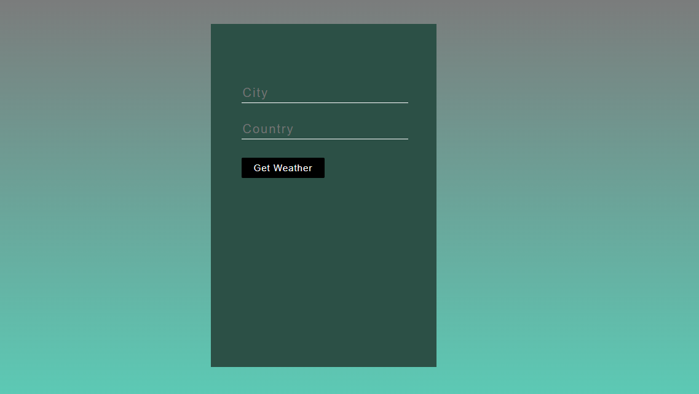

# Weather App

    

## Usage

In order to view the app, Just Click on the Live Demo Link and enjoy 

[**Live Demo**](https://mohaned-weatherapp-react.netlify.app/)

## Description 

This is a practice project on ReactJs. In this project you can enter your city and country then by using the weather API it will get the current Temperature and Humidity.
This is a basic Weather React App.

## Getting Started

To get started developing right away:

* Clone or download the repository
* install all project dependencies with `npm install`
* start the development server with `npm start`
* Navigate to localhost:3000

## Create React App

This project was bootstrapped with [Create React App](https://github.com/facebookincubator/create-react-app). You can find more information on how to perform common tasks [here](https://github.com/facebookincubator/create-react-app/blob/master/packages/react-scripts/template/README.md).